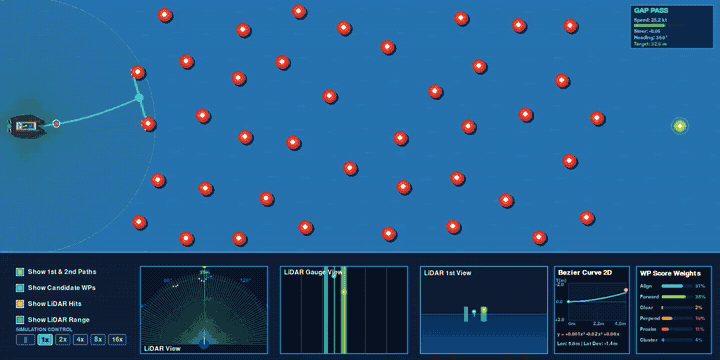
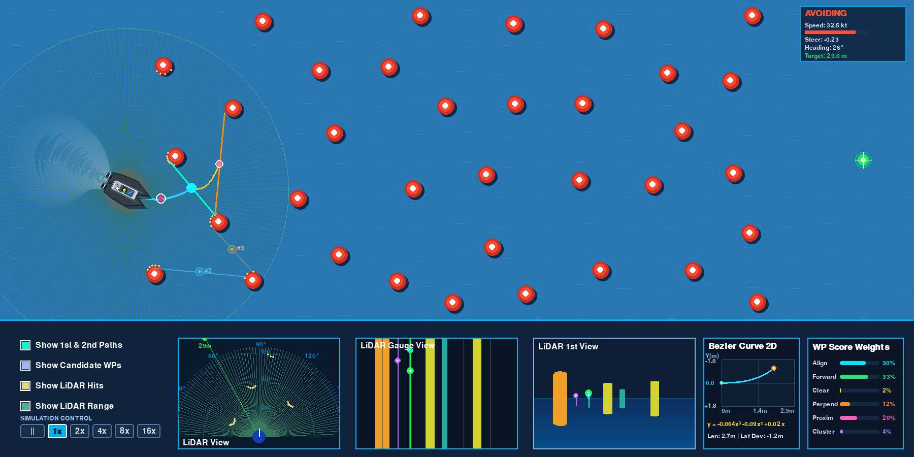
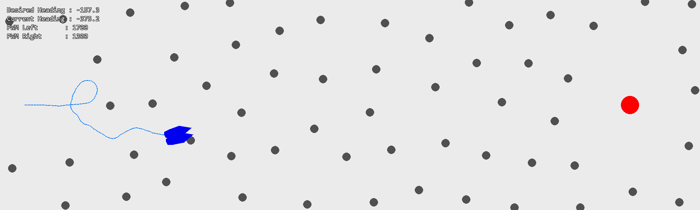
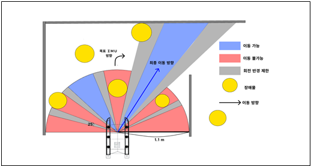
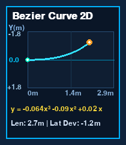
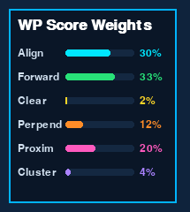
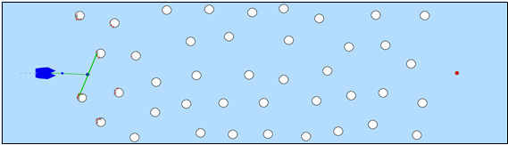
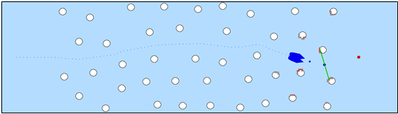

# 자율운항보트 경로 계획 및 장애물 회피 알고리즘 시도
**Autonomous Surface Vehicle Navigation: 갭(Gap) 중심점 기반의 경량 경로 계획 및 3차 베지어 제어**

본 프로젝트는 단순 센서 반사식 제어(라인트레이싱 방식)의 한계를 극복하고, 무거운 SLAM 시스템 없이도 동적 장애물 사이의 틈새(Gap) 중심점을 실시간 웨이포인트로 삼아 부드럽고 유연하게 경로를 계획해보려는 시도와 구현 과정을 담고 있습니다.



실시간 2D 시뮬레이터 4배속 자율운항 5회 연속 주행 데모 (동적 장애물 환경에서 3차 베지어 곡선 기반 갭 탐색 및 경로 추종)

---

## 주행 영상 (Simulation Videos)

다양한 주행 속도에서의 선박 거동과 경로 계획 과정을 담은 주행 영상입니다.

- **1배속 정밀 주행 영상**: [images/simulation_1x.mp4](images/simulation_1x.mp4) (실시간 센서 반응 및 완만한 선회 거동)
- **2배속 연속 주행 영상**: [images/simulation_2x.mp4](images/simulation_2x.mp4) (동적 장애물 사이 연속 우회 통과)
- **4배속 5바퀴 연속 주행 영상**: [images/simulation_5_laps.mp4](images/simulation_5_laps.mp4) (랜덤 배치 환경 5회 연속 완주)

---

## 프로젝트 개요 및 시도의 의의

- **기존 반사형 제어(라인트레이싱)의 탈피**: "장애물이 보이면 반대로 튼다"는 원시적인 조건문 반복에서 벗어나, 장애물 사이의 공간을 인지하고 미래 경로를 그리는 방식을 지향했습니다.
- **경량화된 대안 모색**: 고가의 센서와 방대한 연산, 라벨링 데이터가 필수적인 정밀 SLAM을 소형 무인선 환경에 그대로 올리기 어려운 현실적 제약을 고려하여, SLAM의 약 70% 수준 성능을 가벼운 기하학적 연산으로 대체하는 새로운 접근을 시도했습니다.
- **갭(Gap) 중심점 웨이포인트 추종**: 라이다 클러스터링으로 장애물 사이의 빈 틈을 찾고, 그 중심을 임시 웨이포인트로 삼아 3차 베지어 곡선(Cubic Bézier S-Curve)으로 부드럽게 이어 나갑니다.
- **트레이드오프와 성과**: 다루어야 할 하이퍼파라미터가 늘어나고 튜닝이 복잡해지는 단점이 존재하지만, 단순 반사식 방식 대비 훨씬 빠르고 다양한 장애물 배치에 대한 유연한 적응력을 확인했습니다.



통합 콕핏 대시보드 인터페이스: 선체 기하 모델, 1차(하늘색) 및 2차(주황색) 베지어 궤적, 2D 궤적 프로파일 그래프 및 실시간 상태 정보창

---

## 1. 프로젝트 배경 및 문제 정의

### 1.1 초기 단순 반사 회피(라인트레이싱 방식)의 한계
초기에는 로봇의 라인트레이싱(센서에 선이 닿으면 반대편으로 꺾는 방식)과 유사하게, "라이다 특정 각도에 장애물이 감지되면 반대 방향으로 힘을 가해 조향각을 꺾는" 1차원적 반사 회피(Reactive Avoidance)를 적용했습니다.

그러나 이 방식은 장애물이 밀집된 실제 환경에서 다음과 같은 한계를 드러냈습니다:
* **무한 진동 및 갇힘 현상(Oscillation)**: 양옆에 장애물이 있거나 전방에 장애물이 나타나면 좌우로 회피 명령이 번갈아 발생하여 제자리에서 지그재그로 떨거나 갇히는 문제가 발생했습니다.
* **주행 속도 저하**: 전방의 공간을 내다보고 부드럽게 선회하지 못하고 코앞에서 급격히 감속하거나 급선회해야 하므로 주행 효율이 극도로 떨어졌습니다.



시행착오가 담긴 초기 장면: 연산 시간이 과도하게 길고 구조적으로 불안정했던 구간

### 1.2 SLAM 도입의 현실적 한계와 첫 아이디어
이 문제를 근본적으로 해결하려면 로봇 공학에서 흔히 쓰이는 정밀 SLAM(Simultaneous Localization and Mapping)과 전역 경로 플래너(Global Path Planner)를 도입하는 것이 정석입니다.

그러나 소형 무인보트(KABOAT) 환경에서는 다음과 같은 제약이 있었습니다:
* 고가의 다채널 3D 라이다 및 고정밀 관성센서(IMU) 부재
* 방대한 환경 데이터 수집 및 딥러닝 기반의 라벨링 작업의 어려움
* 저전력 임베디드 보드에서의 무거운 SLAM 알고리즘 연산 부담

**"그렇다면 무거운 지도 작성 없이, 눈앞에 보이는 장애물들 사이의 빈 틈(Gap) 가운데 점을 임의의 웨이포인트로 찍고 그곳만 계속 따라가면 어떨까?"**

이 질문이 본 프로젝트의 출발점이었습니다. 완전한 지도를 그리지 않더라도, 열린 공간의 중점을 순차적으로 이어 나가면 기존 라인트레이싱식 반사 제어보다 훨씬 빠르고 확장성 있는 경로를 만들 수 있을 것이라 판단했습니다.

---

## 2. 시스템 아키텍처 및 센서 인지 (Perception)

### 2.1 실시간 환경 인지 및 격자 지도
즉흥적인 센서 반응 대신, 라이다 포인트들을 격자에 누적하고 군집화하여 공간의 틈새를 찾아내는 인지 파이프라인을 구축했습니다.



기존 알고리즘 구조: 매 프레임 즉흥적 명령 산출로 인해 신뢰성이 낮았던 방식

* **Coarse Grid Map**: $1800 \times 900$ px 경기장을 $4 \times 4$ px 단위 격자로 압축하고 지수 감쇠(Decay) 필터를 적용해 노이즈를 제거했습니다.
* **DBSCAN Clustering**: `sklearn`의 DBSCAN 알고리즘을 도입하여 불연속적인 라이다 점들을 군집화하고 장애물의 중심(Centroid)과 유효 반경을 실시간 추정합니다.


DBSCAN 도입 장면: 불연속적 점들을 군집화해 장애물 형태를 매우 정확하게 추정

### 2.2 라이다 탐색 범위 및 대시보드 패널 상세

시뮬레이터의 라이다 센서는 보트 중심 기준 전방 및 주변 최대 320px(약 32m 환산) 반경을 180개 레이 빔으로 스캔합니다. 화면 하단 대시보드는 이를 다양한 관점에서 실시간 분해하여 표출합니다.

1. **하단 1번째 패널 (LiDAR View - 기본 2D 라이다 화면)**
   보트를 중심으로 전방 180도 부채꼴 영역 내의 장애물 상대 위치와 라이다 레이 빔의 충돌 지점을 2D 평면 위에 직관적으로 보여주는 기본 라이다 시각화 화면입니다.

2. **하단 2번째 패널 (LiDAR Gauge View) - 핵심 데이터 창**
   본 프로젝트에서 가장 중요하게 보는 핵심 데이터 화면입니다.
   - 전방 180도 범위를 1도 단위(총 180개 슬라이스)로 나누어, 각 각도별 장애물 거리를 중간값이나 평균값을 바탕으로 산출하여 색상 막대(빨강: 70px 이내 근접 위험, 주황: 140px 이내, 노랑: 220px, 청록: 안전)로 평면에 펼쳐 놓은 1차원 각도별 거리 프로파일입니다.
   - **핵심 착안점**: 복잡한 환경 지도나 무거운 SLAM 없이도, **전방 180도 기준 1도 단위 각도당 장애물 거리 데이터만을 가지고 장애물 사이 빈 공간의 중간값/평균값을 바탕으로 웨이포인트를 선정하고 그것만 따라가더라도 충분히 매끄럽고 안정적인 회피 주행이 가능함**을 확인했습니다.
   - 화면 상단에 1차 웨이포인트(청록색 핀), 2차 연계 웨이포인트(보라색 핀), 최종 목표 지점(초록색 핀)의 각도 방향이 수직선으로 실시간 매핑됩니다.

3. **하단 3번째 패널 (LiDAR 1st View - 운전석 1인칭 화면)**
   보트 운전석 시점에서 전방을 바라보았을 때 장애물이 얼마나 가깝고 멀리 있는지를 기둥 높이로 표현한 1인칭 깊이 시각화 화면입니다.

4. **하단 4번째 패널 (Bezier Curve 2D - 경로 곡선 화면)**
   보트 현재 위치에서 선정된 목표 웨이포인트까지 부드럽게 이어지는 3차 베지어 곡선을 보트 중심 로컬 좌표계(X: 전방 거리, Y: 좌우 편차) 상에 렌더링하고, 실시간 3차 다항식 수식($y = ax^3 + bx^2 + cx$)을 표출합니다.

5. **하단 5번째 패널 (WP Score Weights - 가중치 분석 화면)**
   여러 빈 공간 중 어느 웨이포인트를 따라갈지 결정할 때 쓰이는 6가지 평가 요소(목표 정렬, 전진 성분, 경로 안전도, 직교성, 근접도, 밀집도 페널티)의 실시간 가중치 비율을 막대 그래프로 보여줍니다.

6. **우측 상단 실시간 운항 정보창**
   현재 보트의 운항 상태(정상 운항 NAVIGATING / 회피 중 AVOIDING / 긴급 회피 EMERGENCY), 실시간 속도(kt), 키 조향값(-1.0 ~ +1.0), 나침반 방위각(Heading deg), 목적지까지 남은 직선 거리(m)를 한눈에 볼 수 있도록 표시합니다.

---

## 3. 경로 계획 및 제어 (Planning & Control)

### 3.1 갭(Gap) 중심점 기반 3차 베지어 곡선(Cubic Bézier Curve)
장애물 사이의 틈(Gap) 중심을 목표로 설정하더라도, 배의 관성과 회전 동역학 때문에 직선으로만 꺾으면 오버슈트나 슬립이 발생합니다. 이를 완화하기 위해 **3차 베지어 곡선(Cubic Bézier S-Curve)**과 **Pure Pursuit**를 결합했습니다.


Pure Pursuit와 베지어 곡선을 결합하여 경로의 lookahead 지점을 추종하도록 구성

- **Inward Lead 제어점 배치**: 선박의 현재 속도 및 목표 각도 오차에 따라 $p_1$ 제어점을 선회 안쪽으로 미리 편향하여 완만한 조기 선회를 유도합니다.
- **외측 반발력 보정 (Repulsive Field Shift)**: 궤적이 장애물 안전 마진 내부로 침범할 경우, 장애물 중심 반대 방향으로 제어점을 밀어내어 충돌 위험을 낮춥니다.

### 3.2 2D 궤적 평면 그래프 및 수치 다항식 표출



실시간 3차 다항식 곡선 패널: 선박 로컬 좌표계 기준의 2D 궤적(X: 전방 거리, Y: 좌우 편차)과 실시간 3차 다항식 y = ax^3 + bx^2 + cx, 궤적 전장(Len), 최종 측방 편차(Lat Dev) 표출

시뮬레이터 우측 하단 패널에서는 선박 국소 좌표계 기준의 베지어 궤적을 2D 그래프로 실시간 렌더링하며, 곡선의 3차 다항식 수식($y = ax^3 + bx^2 + cx$)과 경로 전장(Len), 최종 측방 편차(Lat Dev)를 실시간 모니터링할 수 있도록 구성했습니다.

### 3.3 6요소 종합 갭 평가 시스템 (Multi-Factor Gap Evaluation)



6요소 갭 평가 기여도 막대 게이지: Align(방향 정렬), Forward(전진 성분), Clear(경로 안전도), Perpend(직교성), Proxim(근접도), Cluster(밀집도 페널티) 실시간 가중치 비율 표시

단순히 넓은 틈만 찾아가면 목적지와 멀어지거나 막다른 길로 빠질 수 있으므로, 아래 6가지 지표를 종합 곱연산하여 최적의 1차 및 2차 웨이포인트를 선별합니다.

1. **Align (목적지 방향 정렬)**: 갭 방향과 최종 목표 지점 사이의 각도 일치도 ($e^{-(\Delta\theta / 0.9)^2}$)
2. **Forward (전진 성분)**: 목표 지점을 향한 벡터 투영 전진 기여도
3. **Clear (경로 안전도)**: 갭 중심선 및 진입로 주변 장애물과의 최소 여유 간격
4. **Perpend (수직도)**: 갭 형성 부표 선분과 진행 방향의 직교도 ($|\sin\theta|$, 정면 직교 통과 유도)
5. **Proxim (선박 근접도)**: 선박 현재 위치와의 적정 거리 보정
6. **Cluster (밀집도 페널티)**: 주변 장애물 밀집 영역 회피 감쇠

---

## 4. 주행 성능 및 검증 기록

### 4.1 초기 알고리즘 대비 성능 비교

| 분석 항목 | 초기 알고리즘 (Reactive) | 갭 중심점 추종 (Cubic Bézier) |
| :--- | :--- | :--- |
| **평균 완주 시간** | 약 50초 내외 (실패 빈번) | **약 10초 내외 (최대 5배 개선)** |
| **주행 안정성** | 좌우 미세 진동 및 급선회 | **매끄러운 S-Curve 경로 추종** |
| **환경 적응력** | 복잡한 장애물 배치 시 갇힘 발생 | **열린 틈새를 찾아 능동적 우회** |



개선된 알고리즘의 안정적인 궤적 주행 장면 1



개선된 알고리즘의 안정적인 궤적 주행 장면 2: 그리드 지도 위에서 베지어 곡선 경로를 따라 안정적으로 주행하는 모습

### 4.2 에피소드 반복 검증 기록

지속적인 파라미터 튜닝과 회피 보정 로직 개선을 거치며 기록된 대규모 주행 평가 결과입니다.

| 평가 파일명 | 평가 회차 | 완주 성공 | 충돌 발생 | 성공률 |
| :--- | :--- | :--- | :--- | :--- |
| `success_rate_10000_20260901.txt` | 50회 | 48회 | 2회 | 96.00% |
| `success_rate_10000_20260902.txt` | 7,501회 | 7,353회 | 148회 | 98.03% |
| `success_rate_10000_20260903.txt` | 8,410회 | 8,291회 | 119회 | 98.59% |

---

## 5. 결론 및 시도의 의의

* **접근 방식의 의의**: 무겁고 복잡한 SLAM이나 거대 모델 대신, "장애물 틈새의 중점을 찾아 베지어 곡선으로 추종한다"는 직관적이고 가벼운 아이디어로 출발하여, 기존 라인트레이싱 방식의 고질적 문제였던 진동과 감속을 크게 개선했습니다.
* **한계와 트레이드오프**: 갭 평가 지표(가중치 지수, 전환 임계값 등)가 늘어나면서 튜닝해야 할 파라미터가 많아지고 환경에 따라 조정이 필요하다는 복잡성이 생겼습니다.
* **목표 달성도**: 완벽한 무결점 시스템을 표방하기보다는, 제한된 센서와 경량 연산 자원 안에서 SLAM의 핵심 기능(자유 공간 탐색 및 부드러운 경로 생성)의 약 70% 수준을 새로운 기하학적 제어 방식으로 구현해 본 실전적인 시도에 본 프로젝트의 의의가 있습니다.

---

## 6. 설치 및 실행 가이드 (Quick Start)

### 6.1 저장소 복제

```bash
git clone https://github.com/hi-shp/data_science.git
cd data_science
```

---

### 6.2 가상환경 생성 및 활성화

- **Windows (PowerShell)**:
```powershell
python -m venv venv
.\venv\Scripts\Activate.ps1
```
*(스크립트 권한 오류 발생 시: `Set-ExecutionPolicy -Scope Process -ExecutionPolicy Bypass` 실행 후 활성화)*

- **Linux / macOS**:
```bash
python3 -m venv venv
source venv/bin/activate
```

---

### 6.3 필수 라이브러리 설치

```bash
pip install --upgrade pip
pip install pygame numpy scikit-learn pillow imageio-ffmpeg
```

---

### 6.4 프로그램 실행

#### 1) 실시간 2D 자율운항 시뮬레이터 (GUI)
```bash
python main.py
```
실시간 콕핏 대시보드, 3차 다항식 곡선 패널, 장애물 소나 뷰가 활성화된 시뮬레이터 창이 실행됩니다.

#### 2) 대규모 성공률 자동 평가 스크립트 (CLI/GUI)
```bash
python test_success_rate.py
```
연속 에피소드 고속 자율운항 평가를 수행하며, 실시간 통계 리포트(`success_rate_{회차}_{YYYYMMDD}.txt`)를 자동으로 업데이트합니다.

---

### 6.5 시뮬레이터 인터페이스 조작법

- **SPACEBAR**: 시뮬레이션 일시정지 / 재생 토글 (PAUSE ||)
- **마우스 좌클릭**:
  - 화면 수면 위 빈 공간 클릭: 해당 좌표에 새로운 동적 장애물 즉시 추가
  - 하단 버튼 클릭: 시뮬레이션 배속 변경 (`1x`, `2x`, `4x`, `8x`, `16x`)
- **하단 시각화 레이어 토글**:
  - `Show 1st & 2nd Paths`: 1차(하늘색) 및 2차(주황색) 베지어 추종 경로
  - `Show Candidate WPs`: 차순위 후보 갭(#2, #3) 위치 표시
  - `Show LiDAR Hits`: 라이다 광선 충돌 지점 표시
  - `Show LiDAR Range`: 라이다 탐색 반경 및 레이 라인 표시
