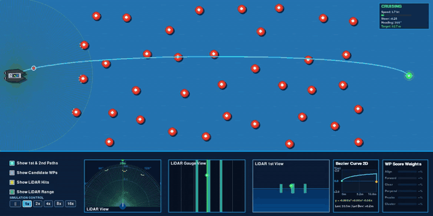
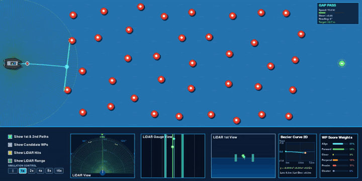

# DBSCAN과 베지어 곡선, 순수추종 알고리즘을 이용한 자율운항 시뮬레이션
**Autonomous Navigation Simulation using DBSCAN, Bézier Curve, and Pure Pursuit**

라이다(LiDAR) 센서 데이터에 DBSCAN 군집화 기법을 적용하여 동적 장애물 사이 유효 간극(Free-space Gap)의 중심점을 추출하고, 3차 베지어 곡선(Cubic Bézier Curve) 및 순수추종(Pure Pursuit) 제어기를 결합하여 실시간 국소 경로를 생성하고 추종하는 2D 자율운항 시뮬레이션 프로젝트입니다.


고속 연산 환경(8배속)에서의 실시간 동적 회피 및 3회 연속 무충돌 완주 검증

---

## 1. 주행 시뮬레이션 검증 결과

소형 무인선 유체 동역학 모델과 다중 동적 장애물이 배치된 가상 수조 환경에서, 알고리즘의 실시간 연산 및 경로 추종 성능을 배속별로 검증한 결과입니다.

### 1배속 주행


1배속 주행: 실시간 센서 인지 주기와 선박 유체 동역학 간의 제어 정합성 검증 (3회 연속 완주)

### 2배속 주행


2배속 주행: 다중 동적 장애물 교차 환경에서의 연속 간극 탐색 및 국소 경로 추종 안정성 검증 (3회 연속 완주)

---

## 2. 프로젝트 개요 및 핵심 원리

- **기존 반사형 제어 방식의 한계 극복**: 특정 각도 장애물 감지 시 단순 반대 방향 조향을 인가하는 조건문 기반 반사식(Reactive) 제어는 장애물 밀집 환경에서 좌우 반복 진동(Oscillation) 및 국소 갇힘(Deadlock)을 초래하는 구조적 한계가 존재함.
- **경량 국소 경로 계획 기법의 필요성**: 고가의 다채널 3D 라이다, 대용량 학습 데이터셋 및 고성능 연산 자원을 요구하는 전역 SLAM 시스템을 소형 무인선에 탑재하기 어려운 물리적 제약을 고려하여, 기하학적 연산 기반의 경량 국소 경로 계획 알고리즘을 설계함.
- **간극(Gap) 중심점 기반 궤적 생성**: 전방 180도 라이다 거리 프로파일로부터 장애물 간 가항 영역(Free-space)의 중심 각도를 도출하고, 이를 3차 베지어 곡선으로 연결하여 선박 회전 관성에 부합하는 연속적 회피 궤적을 산출함.
- **시스템 성능 및 트레이드오프**: 다기준 평가 함수 적용에 따른 최적화 연산 부하를 최소화하면서, 기존 반사식 대비 주행 시간 대폭 단축 및 동적 환경 적응성을 확보함.


통합 콕핏 대시보드 인터페이스: 선박 기하 모델, 다단계 베지어 궤적, 2D 센서 프로파일 및 실시간 상태 정보 패널

---

## 3. 배경 및 문제 정의

### 3.1 단순 반사식 회피 제어의 한계
초기 개발 단계에서 적용한 1차원 반사 회피 로직의 한계점:
- **제자리 진동 및 국소 갇힘 현상**: 대향 장애물 또는 양측 협로 구간 진입 시 좌우 회피 명령이 교번 발생하여 선박이 제자리에서 진동하거나 전진이 정체되는 현상 발생.
- **급격한 조향에 따른 항행 효율 저하**: 전방 유효 공간을 선제적으로 예측하지 못하고 장애물 최근접 영역에서 급격한 감속 및 대각도 조향이 발생하여 항행 효율 급감.


초기 반사형 알고리즘 주행 시험: 연산 지연 및 장애물 최근접 시 궤적 불안정 발생

### 3.2 경량 자율운항 기법의 제안 배경
일반적인 이동 로봇 분야에서는 정밀 SLAM 및 전역 경로 플래너 운용이 일반적이나, 소형 수상 무인선 플랫폼에서는 다음과 같은 제약이 수반됨:
- 3D 라이다 및 고정밀 관성항법장치(INS) 탑재에 따른 중량·전력·비용 부담
- 수상 환경 데이터 수집 및 딥러닝 기반 라벨링의 현실적 난도
- 소형 임베디드 제어기에서의 고부하 연산 지연 발생

이에 따라 전역 지도를 사전에 구축하지 않고도, **전방 라이다 센서의 1도 단위 거리 프로파일에서 장애물 간 유효 간극(Free-space Gap)의 중심점을 실시간 추출하고 이를 국소 웨이포인트로 추종하는 기하학적 경로 계획 기법**을 제안함.

---

## 4. 센서 인지 파이프라인 및 계측 시스템

### 4.1 DBSCAN 기반 장애물 군집화 (Clustering)
단일 프레임 계측 시 발생하는 센서 노이즈에 의한 오반응을 배제하기 위해, 격자 지도 기반 점군 누적 및 군집화 파이프라인을 구축함.


초기 센서 인지 시험: 매 프레임 즉흥적 센서 반응으로 인한 신뢰성 한계

- 경기장 영역을 $4 \times 4$ px 단위 격자로 분할하고 지수 감쇠(Decay) 필터를 적용하여 센서 점군을 누적·정제함.
- DBSCAN(Density-Based Spatial Clustering of Applications with Noise) 알고리즘을 적용하여 불연속 라이다 포인트들을 장애물 객체 단위로 군집화하고, 각 군집의 도심(Centroid) 및 유효 반경을 실시간 산출함.


DBSCAN 군집화 적용: 분산 점군을 객체 단위로 군집화하여 장애물 위치 및 유효 반경 산출

### 4.2 라이다 계측 사양 및 계측 패널 분석

선박에 탑재된 2D 라이다 센서는 선체 중심 기준 전방 180도 부채꼴 영역, 반경 320px(약 32m 환산) 범위를 180개 레이 빔으로 실시간 계측함. 하단 대시보드는 이를 다각도로 분해하여 가시화함.

1. **패널 1 (LiDAR View - 2D 센서 모니터링)**: 선체 중심 전방 180도 FOV(Field of View) 영역 내 장애물 상대 좌표 및 레이 반사점 표출
2. **패널 2 (LiDAR Gauge View - 1차원 거리 프로파일 / 핵심 제어 입력)**:
   본 제어 아키텍처의 핵심 입력 데이터 계층:
   - 전방 180도 영역을 1도 분해능(180채널)으로 양자화하고, 각 방위각별 장애물 거리의 대표값(중간값/평균값)을 1차원 프로파일로 정량화함.
   - **핵심 기술 착안점**: 고부하 전역 SLAM 시스템 없이, **전방 180도 기준 1도 단위 거리 프로파일에서 장애물 간 가항 간극(Free-space Gap)의 중심 방위각을 도출하고 이를 국소 웨이포인트로 추종하는 기하학적 연산만으로 안정적인 동적 충돌 회피를 달성**함.
   - 상단 수직 지표선을 통해 1차 국소 목표점, 2차 연계 목표점, 최종 목적지 방위각을 실시간 정합 표출함.
3. **패널 3 (LiDAR 1st View - 운항자 시점 깊이 프로파일)**: 자함 기준 전방 장애물 상대 거리를 정면 투영 깊이(Depth)로 가시화
4. **패널 4 (Bezier Curve 2D - 국소 계획 궤적)**: 선체 로컬 좌표계 기준 생성된 3차 베지어 회피 궤적, 3차 다항식 피팅 수식($y = ax^3 + bx^2 + cx$), 궤적 전장(Arc Length) 및 목표 측방 편차 산출값 표출
5. **패널 5 (WP Score Weights - 다기준 평가 가중치)**: 다중 간극 중 최적 국소 경로 선정을 위한 6개 평가 지표의 실시간 기여도 가중치 분포
6. **우측 상단 운항 텔레메트리 패널 (Telemetry & Status)**: 운항 모드(정상 항행, 회피, 긴급 회피), 대지 속력(kt), 타각 지령치(-1.0 ~ +1.0), 선수각(Heading deg), 목적지 직선 잔여 거리(m) 정량 모니터링

---

## 5. 국소 경로 계획 및 제어 알고리즘

### 5.1 3차 베지어 곡선(Cubic Bézier Curve) 기반 궤적 생성
장애물 간극 중심점을 단순 직선으로 연결할 경우 선박의 선회 관성에 의한 측방 슬립 및 궤적 오버슈트가 발생하므로, 3차 베지어 곡선을 적용하여 곡률이 연속적인 완만한 회피 궤적을 생성함.


순수추종(Pure Pursuit)과 3차 베지어 곡선 결합 경로 추종 구조

- **선회 안쪽 제어점 선행 배치**: 선속 및 방위각 오차에 비례하여 베지어 시작 제어점을 선회 안쪽으로 선행 편향 배치함으로써 급격한 타각 인가를 방지하고 완만한 조기 선회를 유도함.
- **장애물 반발 포텐셜 마진 보정**: 계산된 궤적이 장애물 안전 한계선 내부로 근접할 경우, 장애물 중심 반대 방향으로 제어점을 외측 편향하여 안전 마진을 동적으로 확보함.

### 5.2 2D 궤적 프로파일 및 다항식 표출


실시간 3차 다항식 곡선 패널: 선체 로컬 좌표계 기준 2D 궤적 및 3차 다항식 수식 표출

선체 로컬 좌표계에서 실시간 생성되는 경로 궤적을 3차 다항식($y = ax^3 + bx^2 + cx$)으로 근사하여 궤적 길이 및 목표 측방 편차를 실시간 산출·모니터링함.

### 5.3 6요소 종합 간극(Gap) 평가 함수


다요소 간극 평가 가중치: 목표 정렬, 전진 성분, 경로 여유도, 직교성, 선체 근접도, 밀집도 비율 표시

단순 최대 간극 추종 시 발생할 수 있는 목표점 이탈 및 막다른 경로 진입을 방지하기 위해, 6가지 공학적 평가 인자를 곱연산하여 최적의 1차 및 2차 웨이포인트를 선별함:
1. **Align (목표 정렬도)**: 간극 중심 방위각과 최종 목표점 간 방위 오차 최소화 ($e^{-(\Delta\theta / 0.9)^2}$)
2. **Forward (전진 기여도)**: 목표 방향 단위 벡터로의 선박 진행 방향 투영 크기
3. **Clear (안전 여유도)**: 간극 진입로 및 중심선 주변 장애물과의 최소 이격 거리
4. **Perpend (직교 통과도)**: 간극 형성 부표 축선에 대한 선박 진입 궤적의 직교성 확보 ($|\sin\theta|$)
5. **Proxim (선체 근접도)**: 선박 현재 위치 기준 안정적 선회 반경 내 유효 거리 적합도
6. **Cluster (밀집도 감쇠)**: 주변 장애물 밀집도가 높은 위험 영역 진입 페널티

---

## 6. 주행 테스트 및 성능 검증 결과

### 6.1 초기 반사형 제어 대비 정량 성능 비교

| 평가 항목 | 초기 반사형 제어 (Reactive) | 간극 추종 제어 (DBSCAN + Bézier) |
| :--- | :--- | :--- |
| **평균 완주 소요 시간** | 약 50초 내외 (진동 정체 다수) | **약 10초 내외 (최대 5배 단축)** |
| **선박 조향 안정성** | 좌우 급격한 교번 조향 발생 | **연속 S자 곡선 궤적 안정 추종** |
| **복합 장애물 대처력** | 협로 및 대향 배치 시 국소 갇힘 | **유효 간극 선별을 통한 안정적 우회** |


DBSCAN 군집화 기반 장애물 인식 및 3차 베지어 회피 궤적 추종 주행


격자 지도 환경에서의 연속 동적 장애물 우회 및 목적지 도달 경로 검증

### 6.2 대규모 에피소드 주행 안정성 시험

장애물 무작위 배치 환경에서의 연속 주행 시험을 통해 정량적 완주율 및 제어 안정성을 평가함.

| 시험 회차 파일명 | 총 시행 횟수 | 완주 성공 | 충돌 발생 | 완주 성공률 |
| :--- | :--- | :--- | :--- | :--- |
| `success_rate_10000_20260901.txt` | 50회 | 48회 | 2회 | 96.00% |
| `success_rate_10000_20260902.txt` | 7,501회 | 7,353회 | 148회 | 98.03% |
| `success_rate_10000_20260903.txt` | 8,410회 | 8,291회 | 119회 | 98.59% |

---

## 7. 결론 및 향후 과제

- **주요 성과**: 고부하 전역 SLAM 시스템 없이도 1차원 라이다 거리 프로파일에서 장애물 간 유효 간극(Free-space Gap) 중심점을 추출하고 3차 베지어 곡선으로 추종하는 기하학적 접근법을 통해, 기존 단순 반사형 제어의 고질적 한계였던 선체 진동 및 정체 현상을 안정적으로 해결함.
- **프로젝트 의의**: 센서 탑재 및 컴퓨팅 자원이 제한되는 소형 수상 무인선 환경에서, 가벼운 기하학적 연산만으로 SLAM 핵심 기능(자유 공간 인지 및 부드러운 국소 경로 생성)의 상당 부분을 실시간 구현할 수 있음을 입증함.
- **향후 개선점**: 조류 및 풍랑 등 외부 환경 외란에 대한 조향 강건성 보강과 환경 변화에 따른 간극 평가 가중치 자동 튜닝 로직 고도화가 가능함.

---

## 8. 시스템 환경 설정 및 실행 가이드

### 8.1 저장소 복제

```bash
git clone https://github.com/hi-shp/data_science.git
cd data_science
```

---

### 8.2 가상환경 구축

- **Windows (PowerShell)**:
```powershell
python -m venv venv
.\venv\Scripts\Activate.ps1
```

- **Linux / macOS**:
```bash
python3 -m venv venv
source venv/bin/activate
```

---

### 8.3 종속 라이브러리 설치

```bash
pip install --upgrade pip
pip install pygame numpy scikit-learn pillow imageio-ffmpeg
```

---

### 8.4 시스템 실행

#### 1) 실시간 자율운항 시뮬레이터 구동 (GUI)
```bash
python main.py
```
통합 콕핏 대시보드 및 센서 인지 파이프라인이 탑재된 실시간 시뮬레이션 환경을 실행함.

#### 2) 대규모 성공률 자동 평가 시험 (CLI/GUI)
```bash
python test_success_rate.py
```
몬테카를로 기반 대규모 에피소드 연속 자율운항 시험을 수행하고 정량 시험 결과 리포트(`success_rate_{회차}_{YYYYMMDD}.txt`)를 자동 갱신·저장함.

---

### 8.5 시뮬레이션 제어 및 가시화 계층 사양

- **시뮬레이션 구동 제어**:
  - `Spacebar`: 시뮬레이션 일시정지(Pause) 및 재개(Resume)
  - `연산 배속 선택`: 시뮬레이션 연산 가속 배율 실시간 전환 (`1x`, `2x`, `4x`, `8x`, `16x`)
  - `동적 장애물 주입`: 환경 영역 마우스 인터랙션을 통한 임의 좌표 동적 장애물 실시간 생성
- **가시화 계층(Visualization Layer) 설정**:
  - `Show 1st & 2nd Paths`: 1차 및 2차 베지어 국소 계획 경로 표출
  - `Show Candidate WPs`: 차순위 후보 웨이포인트 군집 표출
  - `Show LiDAR Hits`: 라이다 레이 센서 유효 반사점 표출
  - `Show LiDAR Range`: 라이다 센서 탐색 유효 영역 및 스캔 빔 표출
