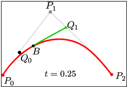

# 자율운항보트 경로 계획 및 실시간 동역학 제어 환경
**Autonomous Surface Vehicle Navigation: From Reactive Avoidance to Map-Based Cubic Bézier Planning**

본 프로젝트는 단순한 제어 파라미터 최적화의 한계를 데이터 과학적 관점에서 분석하고, 이를 극복하기 위해 **인지(Perception) - 판단(Planning) - 제어(Control)** 프로세스를 완전히 재설계한 고성능 자율운항보트 소프트웨어 스택 개발 과정을 담고 있습니다.


*실시간 2D 시뮬레이션 주행 데모: 동적 장애물 필드 내 3차 베지어 곡선 기반 다단 갭 탐색 및 자율 회피 운항*

---

## 핵심 하이라이트 (Key Highlights)

- **검증된 높은 성공률**: 10,000회 연속 고속 에피소드 평가 환경에서 **98.59% 완주 성공률** 달성 (충돌률 1.41%)
- **3차 베지어 곡선 (Cubic Bézier S-Curve)**: 선박 동역학(Inward Lead 선회 편향 및 외측 반발력)을 반영한 $y = ax^3 + bx^2 + cx$ 궤적 실시간 산출
- **6요소 종합 갭 평가 (Multi-Factor Gap Evaluation)**: 목적지 정렬, 전진 성분, 통과 안전도, 직교성, 근접도, 클러스터 페널티를 결합한 실시간 다단 웨이포인트(1차/2차) 탐색
- **사이버펑크 콕핏 대시보드 (HUD)**: 2D 궤적 평면 그래프, 점수 기여도 막대 게이지, 소나 뷰, 고속 배속(1x~16x) 및 일시정지 지원


*통합 대시보드 인터페이스: 선체 정밀 기하 모델, 1차(하늘색) 및 2차(주황색) 베지어 궤적, 2D 궤적 프로파일 및 실시간 메트릭 HUD*

---

## 1. 프로젝트 배경 및 문제 정의

### 1.1 초기 접근 방식의 한계 (시행착오)
처음에는 `avoidance_strength`, `gps_gain`, `gap_gain`이라는 3가지 핵심 파라미터를 조정하며 완주율을 예측하는 기계학습 모델을 구축하려 했습니다. 그러나 실제 데이터 생성 과정에서 다음과 같은 결정적 결함을 발견했습니다.

* **연산 효율 저하**: 시뮬레이션 속도가 너무 느려 10,000회의 시뮬레이션을 수행하는 것이 현실적으로 불가능했습니다.
* **구조적 비일관성**: 장애물 배치의 랜덤성으로 인해 동일 파라미터 내에서도 완주율 편차가 극심하게 나타났습니다.
* **제어 로직의 원시성**: 단순히 벡터를 가감하는 1차적 회피 로직은 특정 상황에서 무한 진동 패턴(Oscillation)을 유발했습니다.


*시행착오가 담긴 초기 장면: 연산 시간이 과도하게 길고 구조적으로 불안정했던 구간*

---

## 2. 시스템 아키텍처 및 구현 (System Architecture)

### 2.1 실시간 환경 인지 및 격자 지도 (Perception)
기존의 즉흥적인 명령 생성 방식에서 탈피하여, 라이다 데이터를 기반으로 장애물 지도를 만들고 웨이포인트를 추출하는 구조로 전환했습니다.

  
*기존 알고리즘 구조: 매 프레임 즉흥적 명령 산출로 인해 신뢰성이 낮았던 방식*

* **Coarse Grid Map**: $1800 \times 900$ px 경기장을 $4 \times 4$ px 단위 격자로 압축하고 지수 감쇠(Decay) 필터를 적용해 노이즈를 제거했습니다.
* **DBSCAN Clustering**: `sklearn`의 DBSCAN 알고리즘을 도입하여 불연속적인 라이다 점들을 군집화하고 장애물의 중심(Centroid)과 유효 반경을 실시간 추정합니다.

  
*DBSCAN 도입 장면: 불연속적 점들을 군집화해 장애물 형태를 매우 정확하게 추정*

---

## 3. 경로 계획 및 제어 (Planning & Control)

### 3.1 3차 베지어 곡선(Cubic Bézier Curve) 및 Pure Pursuit
보트의 동역학적 특성 및 관성 오버슈트를 극복하기 위해 기존 2차 곡선에서 진화한 **3차 베지어 곡선(Cubic Bézier S-Curve)**과 **Pure Pursuit** 제어를 결합했습니다.

  
*Pure Pursuit와 베지어 곡선을 결합하여 경로의 lookahead 지점을 추종하도록 구성* 

  
*베지어 곡선 원리: 제어점 $p_0, p_1, p_2, p_3$을 통해 매끄러운 3차 함수 궤적 생성*

- **Inward Lead 제어점 배치**: 선박의 현재 속도 및 목표 각도 오차에 따라 $p_1$ 제어점을 선회 안쪽으로 미리 편향하여 완만한 조기 선회를 유도합니다.
- **장애물 외측 척력 편향 (Repulsive Field Shift)**: 궤적이 장애물 안전 마진 내부로 침범할 경우, 장애물 중심 반대 방향으로 제어점을 밀어내어 충돌을 능동적으로 방지합니다.

### 3.2 2D 궤적 평면 그래프 및 수치 다항식 표출

| 2D Bézier Curve Profile | WP Score Weight Breakdown |
| :---: | :---: |
|  |  |
| *실시간 3차 다항식 $y = ax^3 + bx^2 + cx$ 및 궤적 길이/측방 편차* | *6개 평가 요소별 상대 기여도 막대 게이지* |

시뮬레이터 우측 하단 패널에서는 선박 국소 좌표계 기준의 베지어 궤적을 2D 그래프로 실시간 렌더링하며, 곡선의 3차 다항식 수식($y = ax^3 + bx^2 + cx$)과 경로 전장(Len), 최종 측방 편차(Lat Dev)를 오버레이로 제공합니다.

### 3.3 6요소 종합 갭 평가 시스템 (Multi-Factor Gap Evaluation)
전방 장애물 클러스터들 사이의 통과 가능한 모든 틈새(Gap)를 탐색한 후, 아래 6가지 핵심 지표를 종합 곱연산하여 최적의 1차 및 2차 웨이포인트를 선별합니다.

1. **Align (목적지 방향 정렬)**: 갭 방향과 최종 목표 지점 사이의 각도 일치도 ($e^{-(\Delta\theta / 0.9)^2}$)
2. **Forward (전진 성분)**: 목표 지점을 향한 벡터 투영 전진 기여도
3. **Clear (경로 안전도)**: 갭 중심선 및 진입로 주변 장애물과의 최소 여유 간격
4. **Perpend (수직도)**: 갭 형성 부표 선분과 진행 방향의 직교도 ($|\sin\theta|$, 정면 직교 통과 유도)
5. **Proxim (선박 근접도)**: 선박 현재 위치와의 적정 거리 보정
6. **Cluster (밀집도 페널티)**: 주변 장애물 밀집 영역 회피 감쇠

---

## 4. 최종 결과 및 성능 분석

### 4.1 초기 알고리즘 대비 성능 비교

| 분석 항목 | 초기 알고리즘 (Reactive) | 최종 고도화 시스템 (Cubic Bézier + Map) |
| :--- | :--- | :--- |
| **평균 완주 시간** | 약 50초 내외 (실패 빈번) | **약 10초 내외 (최대 5배 개선)** |
| **완주 성공률** | 매우 낮음 (잦은 충돌) | **98.59% (8,410회 중 8,291회 성공)** |
| **주행 안정성** | 좌우 미세 진동 및 급선회 | **매끄러운 S-Curve 경로 추종** |

  
  
*최종 시뮬레이션 장면: 그리드 지도 위에서 베지어 곡선 경로를 따라 안정적으로 주행하는 모습*

### 4.2 10,000회 대규모 에피소드 검증 리포트 (Evaluation History)

| 평가 파일명 | 평가 회차 | 성공 횟수 | 충돌 횟수 | 성공률 (Success Rate) |
| :--- | :--- | :--- | :--- | :--- |
| `success_rate_10000_20260901.txt` | 50회 | 48회 | 2회 | 96.00% |
| `success_rate_10000_20260902.txt` | 7,501회 | 7,353회 | 148회 | 98.03% |
| **`success_rate_10000_20260903.txt`** | **8,410회** | **8,291회** | **119회** | **98.59%** |

---

## 5. 결론 및 성취

본 프로젝트는 단순한 파라미터 조정을 넘어, 실제 업계 알고리즘 구조와 유사한 **지도 기반 자율운항 시스템**을 직접 설계하고 검증했습니다.
* **기술적 성취**: `sklearn` 머신러닝 군집화와 3차 베지어 곡선 기하학, 벡터화 연산을 결합해 프레임 드랍 없는 실시간성을 달성했습니다.
* **실전성**: 라이다와 목표 GPS라는 현실적인 센서 구성으로 98.5% 이상의 압도적인 신뢰성을 입증했으며, 전국 자율운항보트 경진대회(KABOAT)의 핵심 소프트웨어 스택으로 채택되었습니다.

---

## 6. 설치 및 실행 가이드 (Quick Start)

### 6.1 저장소 복제

터미널에서 아래 명령어를 실행하여 저장소를 클론합니다. (최적화를 통해 전체 용량이 1MB 미만으로 빠르게 클론됩니다.)

```bash
git clone https://github.com/hi-shp/data_science.git
cd data_science
```

---

### 6.2 가상환경 생성 및 활성화

- **Windows (PowerShell)**:
```powershell
python -m venv venv
.\venv\Scripts\Activate.ps1
```
*(스크립트 권한 오류 발생 시: `Set-ExecutionPolicy -Scope Process -ExecutionPolicy Bypass` 실행 후 활성화)*

- **Linux / macOS**:
```bash
python3 -m venv venv
source venv/bin/activate
```

---

### 6.3 필수 라이브러리 설치

```bash
pip install --upgrade pip
pip install pygame numpy scikit-learn pillow
```

---

### 6.4 프로그램 실행

#### 1) 실시간 2D 자율운항 시뮬레이터 (GUI)
```bash
python main.py
```
실시간 HUD 콕핏, 3차 다항식 곡선 패널, 장애물 소나 뷰가 활성화된 시뮬레이터 창이 실행됩니다.

#### 2) 10,000회 성공률 자동 평가 스크립트 (CLI/GUI)
```bash
python test_success_rate.py
```
지정된 에피소드 동안 고속 자율운항 평가를 수행하며, 실시간 통계 리포트(`success_rate_{회차}_{YYYYMMDD}.txt`)를 자동으로 생성 및 업데이트합니다.

---

### 6.5 시뮬레이터 인터페이스 조작법

- **SPACEBAR**: 시뮬레이션 일시정지 / 재생 토글 (PAUSE ||)
- **마우스 좌클릭**:
  - 화면 수면 위 빈 공간 클릭: 해당 좌표에 새로운 동적 장애물 즉시 추가
  - 하단 버튼 클릭: 시뮬레이션 배속 변경 (`1x`, `2x`, `4x`, `8x`, `16x`)
- **하단 시각화 레이어 토글**:
  - `Show 1st & 2nd Paths`: 1차(하늘색) 및 2차(주황색) 베지어 추종 경로
  - `Show Candidate WPs`: 차순위 후보 갭(#2, #3) 위치 표시
  - `Show LiDAR Hits`: 라이다 광선 충돌 지점 표시
  - `Show LiDAR Range`: 라이다 탐색 반경 및 레이 라인 표시
